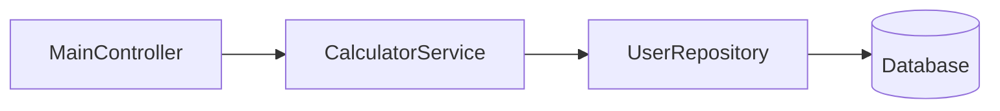

# FlexiTech Fx Framework 🌱

A lightweight, annotation-based dependency injection framework with simplified conventions and improved developer ergonomics.

## Features ✨
- Component registration through annotations
- Dependency management
- Component lifecycle management
- Auto-component scanning
- Properties management
- In-Memory Data Storage

## Modules ✨
- JPA 🔥 [itech-jpa](https://github.com/itech-framework/jpa)
- API Client 🔥[api-client](https://github.com/itech-framework/api-client)
- JavaFX 🔥[java-fx](https://github.com/itech-framework/java-fx)

## Demo Applications
- [Task Management Application](https://github.com/itech-framework/demo)


## Annotations Reference 🔖

### Component Scanning
```java
@ComponentScan(basePackage = "org.itech.framework.test", properties = "application.properties")
public class Main {
    private static final Logger log = LogManager.getLogger(Main.class);
    public static void main(String[] args) {
        log.info("Starting application...");
        ITechApplication.run(Main.class);
    }
}
```
**Attributes**:
- `basePackage`: the based package that the framework to scan all components
- `properties`: initialize properties for `Poperty Management` (optional)

### Component Registration

| Annotation | Target | Level | Attributes | Description |
|------------|--------|-------|------------|-------------|
| `@DataAccess` | Class | 0 | `name` | Database layer components |
| `@BusinessLogic` | Class | 1 | `name` | Business logic services |
| `@Presentation` | Class | 2 | `name` | Controllers, UI handlers |
| `@Component` | Class | 3 | `name` | Utilities, General components |

### Dependency Management
```java
@Rx(name = "userService")
private UserService service;
```
`@Rx` indicates reactive dependency binding (non-blocking IO)

**Attributes**:
- `name`: Custom component name (optional)

### Component Lifecycle management
**InitMethod**

```java
@InitMethod(order=1)
private void run(){
    System.out.println("Component is initialized!");
}
```
**Attributes**:
- `order`: post construct after component is initialized by the order (optional)

**PreDestroy**

```java
@PreDestroy
public void cleanup() {
    // Release resources here
}
```
> **Note**: the framework component resource is automatically clean up after the application stop.

### Properties Management
```porperties
application.name=Test Flexitech Framework
```
```java
@Property(key = "application.name")
private String applicationName;
```
The `@Poperty` annotation is to get the value from the properties file.<br>
**Attribues**:
- `key`: the properties key
- `defaultValue`: the default value of the key (Optional)

### In-Memory Data Storage
```java
@DataStorage(key = "authenticated")
private boolean authenticated;
```
**Attributes**:
- `key`: the storage key (Optional)
#### Data Storage Manager
```java
DataStorageUtil.save("authenticated", isAuthenticated);
```
> **Note**: to save storage key we need to use the `DataStorageUtil.save` for state changes.


## Getting Started 🚀

### Installation
Add to your project via Maven:
```xml
<dependency>
    <groupId>org.itech.framework.fx</groupId>
    <artifactId>itechfx</artifactId>
    <version>1.0-SNAPSHOT</version>
</dependency>
```
### Explanation Of Example Usage  
- Create main application class:
```java
@ComponentScan(basePackage = "org.itech.framework.test")
public class Main {
    private static final Logger log = LogManager.getLogger(Main.class);
    public static void main(String[] args) {
        log.info("Starting application...");
        ITechApplication.run(Main.class);
    }
}
  ```
- Defined a presentation component class:
```java
@Presentation
@Getter
public class MainController {
    @Rx
    private CalculatorService calculatorService;

    @InitMethod
    public void intializedMethod(){
        System.out.println("The sum value of 5 + 5 is: " + calculatorService.plus(5,5));
    }
}
```
The `@Rx` annotation is the dependency injection of the component.
The `@InitMethod` is the post construct method after component has registered and initialized.
> 📌 **Note**: The `@Presentation` annotation is a higher level of component. There are difference levels on component registering. Please see [Component Hierarchy](https://github.com/itech-framework/fx/new/main?filename=README.md#component-hierarchy) documentation.

### Business Service Implementation Example 💡

```java
public interface CalculatorService {
    int plus(int a, int b);
}

@BusinessLogic
public class CalculatorServiceImpl implements CalculatorService {
    @Rx
    private UserRepository repository;

    @Override
    public int plus(int first, int second) {
        return first + second;
    }
}
```

**Implementation Breakdown:**

1. **Service Contract**:
   - `CalculatorService` interface defines the method signature
   - Provides abstraction layer for business logic

2. **Concrete Implementation**:
   - `@BusinessLogic` annotation registers the implementation at business layer (level 1)
   - Automatically discovered and instantiated by the framework

3. **Dependency Management**:
   - `@Rx` injects `UserRepository` (data access layer component)
   - Safe cross-layer dependency (business → data access)

4. **Method Implementation**:
   - Concrete business logic implementation
   - Can combine domain logic with data access operations

**Implementation Strategies:**

| Approach | Example | When to Use |
|----------|---------|-------------|
| **Interface-based** | `CalculatorServiceImpl` | Core business logic, Complex systems |
| **Direct MOJO** | `@BusinessLogic class SimpleCalculator { ... }` | Prototyping, Simple utilities |

> 📌 **Best Practice Recommendation**
> 
> While the framework supports both patterns:
> ```java
> // Interface-based (Recommended)
> @BusinessLogic
> public class ServiceImpl implements ServiceInterface
> 
> // Direct class implementation
> @BusinessLogic
> public class SimpleService
> ```
> We recommend interface-based implementation for:
> - Better testability
> - Clear contract definition
> - Loose coupling
> - Future extensibility

**Dependency Flow:**


**Key Notes:**
- The framework automatically resolves interface implementations
- `@Rx` indicates reactive dependency binding (non-blocking IO)
- Business layer components can safely depend on lower layers (data access)


## Component Hierarchy

The framework organizes components in a layered architecture using priority levels. Components are registered and initialized in order of their priority level (lowest number first), ensuring proper dependency resolution between layers.

### Component Levels

| Level | Constant                 | Priority | Annotation       | Typical Use Case                |
|-------|--------------------------|----------|------------------|---------------------------------|
| 0     | `DATA_ACCESS_LEVEL`      | Highest  | `@DataAccess`    | Database repositories, DAOs     |
| 1     | `BUSINESS_LOGIC_LEVEL`   | High     | `@BusinessLogic` | Service classes, Core logic     |
| 2     | `PRESENTATION_LEVEL`     | Medium   | `@Presentation`  | Controllers, UI handlers        |
| 3     | `DEFAULT_LEVEL`          | Low      | `@Component`     | Utilities, General components   |

### Key Concepts

1. **Initialization Order**:
   ```txt
   Data Access (0) → Business Logic (1) → Presentation (2) → Default (3)
   ```


## 🤝 Support
For assistance:  
📧 Email: `itech.saizawmyint@gmail.com`  
📑 [Open an Issue](https://github.com/itech-framework/fx/issues)

---

*Made with ❤️ by the FlexiTech Team*
